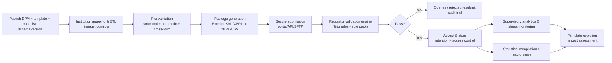
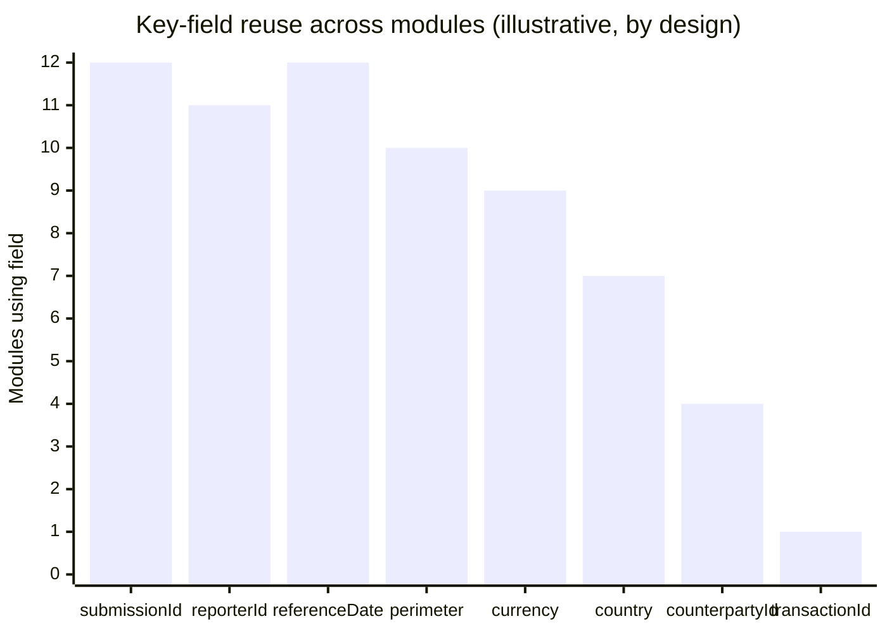
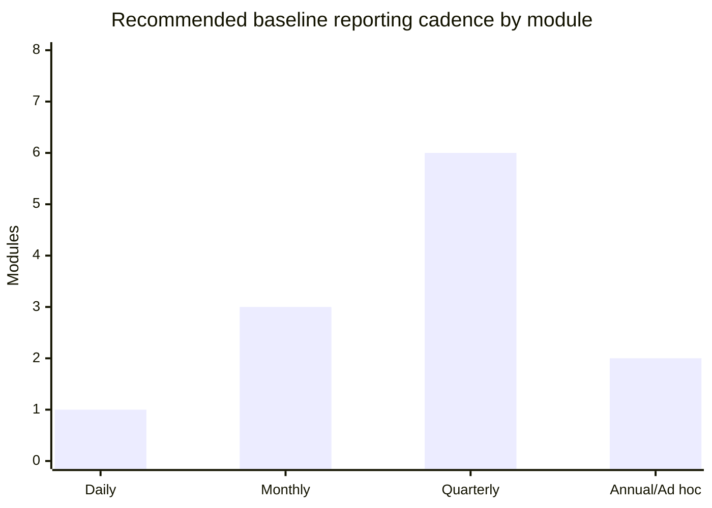

# Production-Ready Central Bank Supervisory Reporting Package for Banking Data Collections

## Executive Summary

“BDC” is **unspecified** and commonly means at least three different things in regulatory contexts: **banking data collections** (central bank / prudential supervisor regulatory + statistical intake), **Bureau de Change** (retail FX dealer), and **Business Development Company** (a U.S. legal term for a regulated closed-end investment company, typically reporting to the securities regulator rather than a central bank). This report assumes the **primary intended meaning** is **banking data collections** and designs a **harmonized, production-ready reporting package** suitable for central-bank/prudential supervisory reporting; it also notes where the other meanings diverge. citeturn6search0turn5view0

The design follows global “known-good” approaches used by leading authorities: a **data dictionary / Data Point Model (DPM)** that defines fields, dimensionality, and validation rules; a **machine-readable implementation** (XSD plus XBRL mapping notes); and a robust **validation + submission workflow** with portal and/or API delivery. This aligns closely with the **European Banking Authority’s** DPM → XBRL taxonomy → validation package paradigm and its transition toward **xBRL-CSV** for reporting with reference dates from **31/03/2026**. citeturn9view1turn9view2turn7search20

The template modules cover: Identity & Perimeter; Governance & Controls; Financial Statements (BS/IS); Asset Quality; Capital & RWA; Liquidity (LCR/NSFR); Large Exposures; Related Parties; Stress Testing outputs; Recovery & Resolution; AML/CFT summary; and a Transaction-level feed. Basel standards provide the canonical basis for liquidity definitions (LCR 30-day stress coverage and HQLA, and NSFR 1-year funding stability) and for risk-data governance expectations (BCBS 239). citeturn10view0turn9view3turn0search1

Operationally, the package supports both:
- **Excel workbook submissions** (for smaller reporters or transitional phases) with strict formatting rules, code lists, and validations; and  
- **machine-to-machine submissions** (XML/XBRL/XBRL-CSV) for scalable, automated ingestion.  
This mirrors real-world supervisory ecosystems, including structured portal workflows with built-in validations and file-size controls (e.g., MAS DCG’s validation model and per-file limit). citeturn3search2turn3search6

## Assumptions, Definitions, and Unspecified Decisions

This package is **jurisdiction-neutral** and intended to be adoptable as a baseline, with jurisdiction-specific overlays (e.g., local chart-of-accounts, domestic liquidity add-ons, or creditor-specific granular returns). It is designed to be compatible with common supervisory practices and standards published/used by: entity["organization","Bank for International Settlements","basel, ch"], entity["organization","Basel Committee on Banking Supervision","basel banking standards"], entity["organization","International Monetary Fund","washington, dc, us"], entity["organization","European Banking Authority","paris, fr"], entity["organization","European Central Bank","frankfurt, de"], entity["organization","Financial Stability Board","basel, ch"], and entity["organization","Financial Action Task Force","paris, fr"]. citeturn9view1turn0search1turn10view0turn1search5turn1search6turn0search3

**Alternative “BDC” meanings (not the primary design target).**
- **Bureau de Change:** Example: the entity["organization","Central Bank of Nigeria","abuja, ng"] defines BDCs as licensed retail FX dealers and requires daily and monthly returns (with explicit submission deadlines) and AML/CFT controls. citeturn5view0  
- **Business Development Company:** U.S. federal law defines a BDC as a type of closed-end company that elects BDC status; reporting is typically within the entity["organization","U.S. Securities and Exchange Commission","washington, dc, us"] framework (e.g., periodic reports), not a central bank supervisory reporting stack. citeturn6search0turn6search1turn6search12

**Core design assumptions for this package (explicit).**
- One submission bundle = one **reporter** + one **referenceDate** + one **perimeter** (solo/subconsolidated/consolidated). Multi-entity groups submit multiple bundles if needed.
- The package supports both **aggregate templates** (balanced, high-quality totals) and **granular overlays** (transactions, top exposures, related parties) using shared identifiers.
- A “DPM-like” model governs naming, definitions, dimensions, and validations, consistent with how EBA operationalizes reporting requirements into a DPM and XBRL taxonomies with validation rules. citeturn9view1turn7search20turn7search1

**Unspecified decisions that materially affect “production-ready” implementation (and recommended options).**
- **Reporter identifier scheme (reporterId):** unspecified. Recommended options:
  - **LEI** (preferred global option): ISO 17442-based, 20-character identifier administered by the global LEI system (good for cross-border groups). citeturn11search0turn11search4  
  - National supervisor ID (domestic licensing identifier).  
  - Hybrid: `reporterId` + `reporterIdScheme` (LEI/NATIONAL/SUPERVISOR/OTHER).  
- **Currency and country code standards:** recommended **ISO 4217** currency codes and **ISO 3166** country codes for interoperability. citeturn11search1turn11search2  
- **Accounting basis:** IFRS vs local GAAP vs regulatory basis (filters). This must be explicitly selected and stated in metadata.
- **Materiality thresholds:** e.g., large exposure reporting threshold; transaction-feed inclusion criteria; NPL definition; stress scenario set. These are jurisdiction decisions and are flagged as parameters in the design.

## Harmonized Excel Reporting Template Design

This section specifies a **single Excel workbook** (“Harmonized Supervisory Reporting Template”) designed for: (i) direct submission (small-to-medium reporters), and (ii) deterministic conversion into XML or XBRL/XBRL-CSV.

### Workbook conventions (mandatory)

**Technical conventions (to enable safe ingestion).**
- No merged cells; no blank header rows; no hidden rows/columns in data tables.
- Each sheet contains exactly one Excel “Table” object named `tbl_<SheetCode>` with fixed headers.
- Dates in `YYYY-MM-DD`; timestamps in `YYYY-MM-DDThh:mm:ssZ` (UTC) or with explicit offset.
- Amounts are numeric decimals; sign conventions are explicit per sheet (e.g., assets positive; liabilities positive; net positions may be signed—choose and document per sheet).
- Code-list fields must match the CodeLists sheet exactly (no free text).
- Each record has a stable `recordId` (UUID) for traceability and resubmissions.

This aligns with how reporting platforms constrain structure to remove ambiguity. For example, the Federal Reserve’s Reporting Central file upload model relies on stable identifiers (MDRM descriptors) and strict formatting to support automated ingestion and validation. citeturn8view0turn8view1

### Sheet list (minimum viable production package)

| SheetCode | Sheet name | Purpose | Primary key columns (minimum) | Typical frequency (recommended) |
|---|---|---|---|---|
| HDR | Submission_Header | Submission metadata + attestation pointers | `submissionId` | Every submission |
| CL | CodeLists | Enumerations/code lists used across the workbook | `codeListName`,`code` | On change (versioned) |
| IDP | Identity_Perimeter | Reporter identity + consolidation perimeter + scope/exclusions | `reporterId`,`perimeter` | On change + each submission recap |
| GOV | Governance_Controls | Governance attestations + control exceptions + model/IT changes | `controlEventId` | Quarterly + event-driven |
| BS | FinancialStatements_BS | Balance sheet positions (regulatory view) | `lineItemCode`,`currency` | Monthly/Quarterly |
| IS | FinancialStatements_IS | Income statement flows | `lineItemCode`,`currency` | Quarterly |
| AQ | AssetQuality | Asset quality metrics by portfolio slice | `portfolioId`,`dimensionSetId` | Monthly/Quarterly |
| CR | Capital_RWA | Capital components and RWA breakdowns | `capitalLineCode` / `rwaLineCode` | Quarterly |
| LQ | Liquidity_LCR_NSFR | LCR and NSFR components and ratios | `liqMetricCode`,`currency` | Monthly/Quarterly (NSFR ≥ quarterly) |
| LE | LargeExposures | Largest counterparties and limit monitoring | `counterpartyId`,`exposureTypeCode` | Quarterly |
| RP | RelatedParties | Related party registry + exposures | `relatedPartyId`,`exposureId` | Quarterly |
| ST | StressTesting | Scenario definition + outputs | `scenarioId`,`metricCode`,`timeHorizon` | Quarterly + ad hoc |
| RR | RecoveryResolution | Key recovery/resolution data (summary level) | `rrTopicCode`,`metricCode` | Annual + ad hoc |
| AML | AMLCFT_Summary | AML/CFT KPIs and STR/SAR operational metrics | `amlMetricCode` | Monthly/Quarterly |
| TXN | Transactions | Transaction-level feed (large file) | `transactionId` | Daily/near-real-time (configurable) |
| XREF | CrossForm_Recon | Cross-form reconciliation checks/certifications | `reconCheckCode` | Every submission |

Basel NSFR guidance explicitly refers to ongoing compliance and states that NSFR should be reported **at least quarterly**, which the LQ sheet design supports by making frequency a parameter. citeturn9view3

### Common fields used across modules (harmonized “spine”)

These fields enable joins across sheets and deterministic conversion to XML/XBRL contexts/dimensions:

| Field | Type | Used in sheets | Notes |
|---|---|---|---|
| submissionId | UUID | All | Bundle identifier; ties sheets together |
| schemaVersion | string | HDR | Version string (e.g., `1.0.0`) |
| reporterId | string | HDR, IDP | With `reporterIdScheme` |
| reporterIdScheme | enum | HDR, IDP | `LEI`, `SUPERVISOR_ID`, `NATIONAL_ID`, `OTHER` |
| referenceDate | date | HDR, all data sheets | Reporting reference date |
| perimeter | enum | HDR, IDP | `SOLO`, `SUBCON`, `CONS` |
| reportingCurrency | ISO 4217 | HDR | Default currency for amounts unless overridden citeturn11search1 |
| recordId | UUID | All data sheets | Row-level traceability |
| lastUpdatedAt | datetime | All data sheets | For resubmission tracking |

### CodeLists sheet (CL) design

**CL sheet columns.**

| Column header | Type | Required | Example |
|---|---|---|---|
| codeListName | string | Y | `PerimeterCode` |
| code | string | Y | `CONS` |
| label | string | Y | `Consolidated` |
| definition | string | N | `Group consolidated perimeter` |
| effectiveFrom | date | N | `2026-01-01` |
| effectiveTo | date | N | *(blank)* |
| sortOrder | integer | N | `1` |

**Minimum code lists (production baseline).**
- `PerimeterCode`: `SOLO`, `SUBCON`, `CONS`
- `ReporterIdScheme`: `LEI`, `SUPERVISOR_ID`, `NATIONAL_ID`, `OTHER` (recommend LEI per ISO 17442/LEI system) citeturn11search0
- `CountryCode`: ISO 3166 alpha-2 recommended citeturn11search2
- `CurrencyCode`: ISO 4217 alpha-3 recommended citeturn11search1
- `HQLALevel`: `L1`, `L2A`, `L2B` (Basel LCR HQLA levels) citeturn10view0
- `RiskType`: `CREDIT`, `MARKET`, `OPERATIONAL`, `CVA`, `OTHER`
- `AMLMetricCode`: standardized KPI set (defined in AML sheet instructions; aligned to FATF expectation of effective AML/CFT systems) citeturn1search6

### Module-by-module sheet designs (columns, types, validations, examples)

The tables below define **column headers** (machine-stable), recommended data types, validation rules, and **example rows**.

#### HDR sheet (Submission_Header)

**HDR table columns and example.**

| Column | Type | Required | Validation | Example |
|---|---|---:|---|---|
| submissionId | UUID | Y | Must be RFC 4122 UUID | `550e8400-e29b-41d4-a716-446655440000` |
| schemaVersion | string | Y | SemVer (`major.minor.patch`) | `1.0.0` |
| reporterId | string | Y | Non-empty; scheme-specific format | `506700GE1G29325QX363` |
| reporterIdScheme | enum | Y | In `ReporterIdScheme` | `LEI` |
| referenceDate | date | Y | `YYYY-MM-DD` | `2026-03-31` |
| perimeter | enum | Y | In `PerimeterCode` | `CONS` |
| periodStartDate | date | N | Required for duration metrics | `2026-01-01` |
| periodEndDate | date | N | Required for duration metrics | `2026-03-31` |
| reportingCurrency | string | Y | ISO 4217 | `USD` |
| submissionChannel | enum | Y | `PORTAL`,`API`,`SFTP`,`OTHER` | `PORTAL` |
| preparedByName | string | Y | Non-empty | `Jane Doe` |
| preparedByRole | string | Y | Non-empty | `Regulatory Reporting Lead` |
| preparedAt | datetime | Y | ISO datetime | `2026-04-10T10:15:00Z` |
| attestationType | enum | Y | `SUBMITTED`,`RESUBMITTED`,`CORRECTION` | `SUBMITTED` |
| attestedByName | string | Y | Non-empty | `John Smith` |
| attestedByRole | string | Y | Non-empty | `CFO` |
| attestedAt | datetime | Y | ISO datetime | `2026-04-10T10:45:00Z` |
| attestationStatement | string | Y | Length ≤ 2,000 | `I attest the submission is complete...` |
| signatureMethod | enum | N | `WET`,`PKI`,`PORTAL_SIGN`,`OTHER` | `PKI` |
| signatureReference | string | N | File hash / certificate id | `sha256:...` |

**Why this mirrors real practice.** Supervisory filing rules frequently constrain instance construction and emphasize consistent metadata to reduce ambiguity, as reflected in EBA filing rules and the institutional preparation/validation/remittance process. citeturn9view0

#### IDP sheet (Identity_Perimeter)

| Column | Type | Required | Validation | Example |
|---|---|---:|---|---|
| submissionId | UUID | Y | FK to HDR | `...` |
| recordId | UUID | Y | Unique | `...` |
| legalEntityName | string | Y | Non-empty | `Example Bank Group Plc` |
| legalFormCode | string | N | Code list optional | `PLC` |
| incorporationCountry | string | Y | ISO 3166 | `GB` |
| homeSupervisorName | string | N | Free text | `PRA` |
| consolidationBasis | enum | Y | `SOLO`,`SUBCON`,`CONS` | `CONS` |
| consolidationStandard | enum | Y | `IFRS`,`LOCAL_GAAP`,`REGULATORY` | `IFRS` |
| perimeterNarrative | string | N | ≤ 5,000 chars | `Includes X subsidiaries; excludes Y due to...` |
| excludedEntityCount | integer | N | ≥0 | `2` |
| materialChangeFlag | boolean | Y | True/False | `false` |
| materialChangeDescription | string | Conditional | Required if flag true | *(blank)* |

**Validation rules (sheet-level).**
- If `materialChangeFlag=true`, `materialChangeDescription` is required.
- Country and currency must match ISO code lists. citeturn11search1turn11search2

#### GOV sheet (Governance_Controls)

| Column | Type | Required | Validation | Example |
|---|---|---:|---|---|
| submissionId | UUID | Y | FK to HDR | `...` |
| controlEventId | UUID | Y | Unique | `...` |
| controlEventType | enum | Y | `DATA_ISSUE`,`MODEL_CHANGE`,`SYSTEM_CHANGE`,`POLICY_CHANGE` | `DATA_ISSUE` |
| severity | enum | Y | `LOW`,`MEDIUM`,`HIGH`,`CRITICAL` | `HIGH` |
| affectedModule | enum | Y | `BS`,`IS`,`AQ`,`CR`,`LQ`,`LE`,`RP`,`ST`,`RR`,`AML`,`TXN` | `AQ` |
| description | string | Y | Non-empty | `ECL staging mapping changed...` |
| detectedAt | datetime | Y | ISO datetime | `2026-04-05T09:00:00Z` |
| resolvedFlag | boolean | Y | True/False | `false` |
| resolutionDate | date | Conditional | Required if resolved | *(blank)* |
| remediationPlan | string | N | ≤ 5,000 | `Implement new mapping table...` |

**Standards anchor.** Risk-data governance and strong controls are explicitly emphasized in BCBS 239 and in supervisory guidance that builds on it. citeturn0search1turn0search9

#### BS sheet (FinancialStatements_BS)

**Design principle:** This sheet is a **line-item table** (not a full T-account). The regulator owns the line-item dictionary (`lineItemCode`) and publishes it as part of the DPM/taxonomy.

| Column | Type | Required | Validation | Example |
|---|---|---:|---|---|
| submissionId | UUID | Y | FK | `...` |
| recordId | UUID | Y | Unique | `...` |
| lineItemCode | string | Y | In `BS_LineItems` | `ASSET_CASH` |
| lineItemLabel | string | N | Optional label | `Cash and balances at CB` |
| currency | string | Y | ISO 4217 | `USD` |
| amount | decimal(20,2) | Y | Numeric | `125000000.00` |
| accountingMeasurement | enum | Y | `AMORTIZED_COST`,`FVOCI`,`FVTPL`,`OTHER` | `AMORTIZED_COST` |
| counterpartySector | enum | N | Standard sector list | `CENTRAL_BANK` |
| maturityBucket | enum | N | `ON`,`LT_1M`,… | `LT_1M` |
| geography | string | N | ISO 3166 | `US` |
| comment | string | N | ≤ 1,000 | *(blank)* |

**Critical arithmetic validations (cross-row within sheet).**
- `BS_TOTAL_ASSETS = SUM(ASSET_*)`
- `BS_TOTAL_LIAB_EQUITY = SUM(LIAB_*) + SUM(EQUITY_*)`
- `BS_TOTAL_ASSETS = BS_TOTAL_LIAB_EQUITY` (error if not)

This “line-item + calculation rules” approach strongly resembles real supervisory reporting form architectures (e.g., report schedules with line items and instruction books). citeturn2search7turn2search11

#### IS sheet (FinancialStatements_IS)

| Column | Type | Required | Validation | Example |
|---|---|---:|---|---|
| submissionId | UUID | Y | FK | `...` |
| recordId | UUID | Y | Unique | `...` |
| lineItemCode | string | Y | In `IS_LineItems` | `IS_NET_INTEREST_INCOME` |
| currency | string | Y | ISO 4217 | `USD` |
| periodStart | date | Y | Must equal HDR.periodStartDate | `2026-01-01` |
| periodEnd | date | Y | Must equal HDR.periodEndDate | `2026-03-31` |
| amount | decimal(20,2) | Y | Numeric | `83000000.00` |

**Cross-sheet reconciliation (BS ↔ IS) examples.**
- Average assets (if reported) vs interest income plausibility (secondary check).
- Retained earnings movement vs net profit and dividends (if equity movement is included as optional extension).

#### AQ sheet (AssetQuality)

| Column | Type | Required | Validation | Example |
|---|---|---:|---|---|
| submissionId | UUID | Y | FK | `...` |
| recordId | UUID | Y | Unique | `...` |
| portfolioId | string | Y | Non-empty | `RETAIL_MORTGAGE` |
| productType | enum | Y | Code list | `MORTGAGE` |
| counterpartySector | enum | Y | Sector list | `HOUSEHOLD` |
| geography | string | Y | ISO 3166 | `GB` |
| stage | enum | Y | `STAGE1`,`STAGE2`,`STAGE3`,`POCI`,`N_A` | `STAGE2` |
| pastDueBucket | enum | Y | `CURRENT`,`1_30`,`31_60`,`61_90`,`90_PLUS` | `31_60` |
| grossCarryingAmount | decimal(20,2) | Y | ≥0 | `2500000000.00` |
| impairmentAllowance | decimal(20,2) | Y | ≥0 | `45000000.00` |
| nplAmount | decimal(20,2) | N | ≥0 | `12000000.00` |
| collateralValue | decimal(20,2) | N | ≥0 | `1800000000.00` |

**Plausibility rules.**
- `impairmentAllowance <= grossCarryingAmount` (error)
- If `pastDueBucket=90_PLUS` then `nplAmount` should be present (warning if missing).

#### CR sheet (Capital_RWA)

This sheet is a **two-table sheet** (two Excel tables) or two separate sheets; production simplicity favors two separate sheets (`CAP` and `RWA`). Below is unified for readability.

**Capital subset (CAP).**

| Column | Type | Required | Example |
|---|---|---:|---|
| submissionId | UUID | Y | `...` |
| recordId | UUID | Y | `...` |
| capitalLineCode | enum | Y | `CET1`,`AT1`,`T2`,`DEDUCTIONS`,`TOTAL_CAPITAL` |
| amount | decimal(20,2) | Y | `CET1 = 6500000000.00` |
| currency | string | Y | `USD` |

**RWA subset (RWA).**

| Column | Type | Required | Example |
|---|---|---:|---|
| submissionId | UUID | Y | `...` |
| recordId | UUID | Y | `...` |
| riskType | enum | Y | `CREDIT` |
| exposureClass | enum | Y | `CORPORATE` |
| approach | enum | Y | `STD` |
| rwaAmount | decimal(20,2) | Y | `42000000000.00` |

**Basel alignment note.** The package separates (a) capital components and (b) RWA decomposition so that ratio calculations can be validated and mapped to XBRL concepts and dimensions in a DPM-like architecture. citeturn9view1turn0search1

#### LQ sheet (Liquidity_LCR_NSFR)

**LCR rows (per Basel LCR structure).** LCR measures a stock of unencumbered HQLA over 30-day net cash outflows in a stress scenario; the template captures HQLA breakdowns and inflow/outflow components. citeturn10view0

| Column | Type | Required | Example |
|---|---|---:|---|
| submissionId | UUID | Y | `...` |
| recordId | UUID | Y | `...` |
| liqMetric | enum | Y | `LCR_HQLA`,`LCR_NET_OUTFLOWS`,`LCR_RATIO` |
| hqlaLevel | enum | N | `L1` / `L2A` / `L2B` | `L1` |
| amount | decimal(20,2) | Y for amounts | `LCR_HQLA L1 = 9800000000.00` |
| currency | string | Y | `USD` |
| ratio | decimal(9,6) | Y for ratios | `LCR_RATIO = 1.21` |

**NSFR rows (per Basel NSFR structure).** NSFR requires stable funding relative to assets/off-balance sheet exposures over a one-year horizon; the template captures ASF, RSF, and NSFR ratio. Basel specifies the NSFR should be reported at least quarterly. citeturn9view3

| Column | Type | Required | Example |
|---|---|---:|---|
| submissionId | UUID | Y | `...` |
| recordId | UUID | Y | `...` |
| liqMetric | enum | Y | `NSFR_ASF`,`NSFR_RSF`,`NSFR_RATIO` |
| nsfrCategory | string | N | Category code | `ASF_STABLE_RETAIL` |
| amount | decimal(20,2) | Y for amounts | `NSFR_ASF = 54000000000.00` |
| currency | string | Y | `USD` |
| ratio | decimal(9,6) | Y for ratios | `NSFR_RATIO = 1.07` |

#### LE sheet (LargeExposures)

| Column | Type | Required | Example |
|---|---|---:|---|
| submissionId | UUID | Y | `...` |
| recordId | UUID | Y | `...` |
| counterpartyId | string | Y | `CPTY_000123` |
| counterpartyIdScheme | enum | Y | `LEI`,`INTERNAL`,`OTHER` |
| counterpartyName | string | N | `Big Corp Ltd` |
| exposureType | enum | Y | `LOAN`,`BOND`,`DERIV`,`COMMITMENT`,`OTHER` |
| grossExposure | decimal(20,2) | Y | `2500000000.00` |
| crmEligibleAmount | decimal(20,2) | N | `600000000.00` |
| netExposure | decimal(20,2) | Y | `1900000000.00` |
| limitAmount | decimal(20,2) | N | `2200000000.00` |
| breachFlag | boolean | Y | `false` |

**Note:** Many jurisdictions implement large exposure reporting in structured modules; the design supports mapping to a DPM/taxonomy approach consistent with EBA-style modeling. citeturn9view1turn7search20

#### RP sheet (RelatedParties)

| Column | Type | Required | Example |
|---|---|---:|---|
| submissionId | UUID | Y | `...` |
| recordId | UUID | Y | `...` |
| relatedPartyId | string | Y | `RP_000045` |
| relatedPartyType | enum | Y | `DIRECTOR`,`SUBSIDIARY`,`AFFILIATE`,`KEY_MGMT`,`SHAREHOLDER` |
| relationshipDescription | string | N | `Board director` |
| exposureId | string | Y | `RPEXP_1022` |
| exposureType | enum | Y | `LOAN`,`GUARANTEE`,`DEPOSIT`,`SERVICE`,`OTHER` |
| amount | decimal(20,2) | Y | `5000000.00` |
| termsArmLengthFlag | boolean | Y | `true` |
| approvalDate | date | N | `2026-02-12` |

#### ST sheet (StressTesting)

| Column | Type | Required | Example |
|---|---|---:|---|
| submissionId | UUID | Y | `...` |
| recordId | UUID | Y | `...` |
| scenarioId | string | Y | `SCN_BASE_2026Q1` |
| scenarioType | enum | Y | `BASELINE`,`ADVERSE`,`SEVERE` |
| metricCode | enum | Y | `CET1_RATIO`,`LCR_RATIO`,`NSFR_RATIO`,`NPL_RATIO` |
| timeHorizon | enum | Y | `T0`,`T+3M`,`T+12M` |
| value | decimal(18,6) | Y | `1.05` |
| unit | enum | Y | `RATIO`,`PCT`,`CCY` |

#### RR sheet (RecoveryResolution)

Design is intentionally **summary-level** and “overlay-ready” (can be extended with resolvability datasets). FSB Key Attributes provide the high-level global baseline for effective resolution regimes, implying the need for high-quality information to support resolution planning and execution. citeturn1search5

| Column | Type | Required | Example |
|---|---|---:|---|
| submissionId | UUID | Y | `...` |
| recordId | UUID | Y | `...` |
| rrTopicCode | enum | Y | `CRITICAL_FUNCTIONS`,`FUNDING_IN_RESOLUTION`,`OP_CONTINUITY`,`MREL_TLAC_PROFILE` |
| metricCode | string | Y | `TOTAL_BAILINABLE_LIAB` |
| amount | decimal(20,2) | N | `18000000000.00` |
| currency | string | Conditional | `USD` |
| narrative | string | N | `Summary of critical functions mapping...` |

#### AML sheet (AMLCFT_Summary)

FATF Recommendations are the global AML/CFT standard; this module is designed as **supervisory KPIs** and does not attempt to replace jurisdiction-specific STR/SAR XML formats. citeturn1search6turn1search2

| Column | Type | Required | Example |
|---|---|---:|---|
| submissionId | UUID | Y | `...` |
| recordId | UUID | Y | `...` |
| amlMetricCode | enum | Y | `STR_COUNT`,`SANCTIONS_ALERTS`,`HIGH_RISK_CUSTOMERS` |
| periodStart | date | Y | `2026-01-01` |
| periodEnd | date | Y | `2026-03-31` |
| valueNumber | decimal(20,4) | Y | `145` |
| unit | enum | Y | `COUNT`,`PCT`,`CCY` |
| commentary | string | N | `Increase due to new monitoring rule...` |

#### TXN sheet (Transactions)

This sheet supports high-volume daily feeds (retail + wholesale transaction extracts) and is designed for file chunking and API delivery. It mirrors real-world transaction-wise reporting expectations (e.g., RBI daily transaction-wise reporting via CSV upload; and FX-dealer daily returns obligations in some regimes). citeturn3search1turn5view0

| Column | Type | Required | Example |
|---|---|---:|---|
| submissionId | UUID | Y | `...` |
| transactionId | string | Y | `TXN20260331-000001` |
| transactionTimestamp | datetime | Y | `2026-03-31T14:22:10Z` |
| valueDate | date | Y | `2026-03-31` |
| productCode | enum | Y | `FX_SPOT`,`CARD_PAYMENT`,`WIRE`,`CASH` |
| direction | enum | Y | `IN`,`OUT` |
| amount | decimal(20,2) | Y | `10000.00` |
| currency | string | Y | `USD` |
| counterCurrency | string | N | `NGN` |
| fxRate | decimal(18,8) | N | `1480.25000000` |
| customerRef | string | N | `CUST_88301` |
| kycRiskRating | enum | N | `LOW`,`MEDIUM`,`HIGH` |
| channel | enum | Y | `BRANCH`,`ONLINE`,`MOBILE`,`AGENT` |
| suspiciousFlag | boolean | Y | `false` |

### Sample Excel snippets (tables)

**Snippet 1: BS sheet (FinancialStatements_BS) — minimal example**

| submissionId | recordId | lineItemCode | currency | amount | accountingMeasurement |
|---|---|---|---|---:|---|
| 550e8400-e29b-41d4-a716-446655440000 | 9df7… | ASSET_CASH | USD | 125000000.00 | AMORTIZED_COST |
| 550e8400-e29b-41d4-a716-446655440000 | a12b… | ASSET_LOANS_GROSS | USD | 45000000000.00 | AMORTIZED_COST |
| 550e8400-e29b-41d4-a716-446655440000 | b33c… | LIAB_DEPOSITS | USD | 38000000000.00 | AMORTIZED_COST |
| 550e8400-e29b-41d4-a716-446655440000 | c44d… | EQUITY_TOTAL | USD | 9000000000.00 | OTHER |
| 550e8400-e29b-41d4-a716-446655440000 | d55e… | BS_TOTAL_ASSETS | USD | 47000000000.00 | OTHER |
| 550e8400-e29b-41d4-a716-446655440000 | e66f… | BS_TOTAL_LIAB_EQUITY | USD | 47000000000.00 | OTHER |

**Snippet 2: TXN sheet (Transactions) — minimal example**

| submissionId | transactionId | transactionTimestamp | productCode | direction | amount | currency | channel | suspiciousFlag |
|---|---|---|---|---|---:|---|---|---|
| 550e8400-e29b-41d4-a716-446655440000 | TXN20260331-000001 | 2026-03-31T14:22:10Z | WIRE | OUT | 10000.00 | USD | ONLINE | false |
| 550e8400-e29b-41d4-a716-446655440000 | TXN20260331-000002 | 2026-03-31T16:01:44Z | FX_SPOT | OUT | 1500.00 | EUR | BRANCH | false |

## Machine-Readable Artifacts: XSD, XML Instance Fragments, and XBRL Mapping Notes

Regulators increasingly implement reporting with a DPM + taxonomy + validation package approach. EBA explicitly describes the translation of reporting requirements into a DPM and technical implementation in XBRL taxonomies containing data items, business concepts, relationships, and validation rules; and it operates a continuous validation rules packaging lifecycle. citeturn9view1

### XSD (XML Schema Definition) for the harmonized template

The XSD below is **implementation-grade** for the baseline modules and intended to be combined with:
- a published regulator code list pack (as XSD simpleType enumerations or external code lists), and  
- business-rule validation (Schematron/XBRL Formula) for cross-form arithmetic.

```xml
<?xml version="1.0" encoding="UTF-8"?>
<xs:schema xmlns:xs="http://www.w3.org/2001/XMLSchema"
           targetNamespace="urn:cb:mvrd:supervisory:1.0"
           xmlns="urn:cb:mvrd:supervisory:1.0"
           elementFormDefault="qualified"
           attributeFormDefault="unqualified">

  <!-- =========================
       Simple types
       ========================= -->

  <xs:simpleType name="UUIDType">
    <xs:restriction base="xs:string">
      <xs:pattern value="[0-9a-fA-F]{8}-[0-9a-fA-F]{4}-[1-5][0-9a-fA-F]{3}-[89abAB][0-9a-fA-F]{3}-[0-9a-fA-F]{12}"/>
    </xs:restriction>
  </xs:simpleType>

  <xs:simpleType name="PerimeterType">
    <xs:restriction base="xs:string">
      <xs:enumeration value="SOLO"/>
      <xs:enumeration value="SUBCON"/>
      <xs:enumeration value="CONS"/>
    </xs:restriction>
  </xs:simpleType>

  <xs:simpleType name="ReporterIdSchemeType">
    <xs:restriction base="xs:string">
      <xs:enumeration value="LEI"/>
      <xs:enumeration value="SUPERVISOR_ID"/>
      <xs:enumeration value="NATIONAL_ID"/>
      <xs:enumeration value="OTHER"/>
    </xs:restriction>
  </xs:simpleType>

  <xs:simpleType name="ISODateType">
    <xs:restriction base="xs:date"/>
  </xs:simpleType>

  <xs:simpleType name="ISODatetimeType">
    <xs:restriction base="xs:dateTime"/>
  </xs:simpleType>

  <xs:simpleType name="CurrencyCodeType">
    <xs:restriction base="xs:string">
      <xs:length value="3"/>
      <xs:pattern value="[A-Z]{3}"/>
    </xs:restriction>
  </xs:simpleType>

  <xs:simpleType name="CountryCodeType">
    <xs:restriction base="xs:string">
      <xs:length value="2"/>
      <xs:pattern value="[A-Z]{2}"/>
    </xs:restriction>
  </xs:simpleType>

  <xs:simpleType name="BooleanType">
    <xs:restriction base="xs:boolean"/>
  </xs:simpleType>

  <xs:simpleType name="AmountType">
    <xs:restriction base="xs:decimal">
      <xs:totalDigits value="20"/>
      <xs:fractionDigits value="2"/>
    </xs:restriction>
  </xs:simpleType>

  <xs:simpleType name="RatioType">
    <xs:restriction base="xs:decimal">
      <xs:totalDigits value="18"/>
      <xs:fractionDigits value="6"/>
    </xs:restriction>
  </xs:simpleType>

  <!-- =========================
       Complex types: Header
       ========================= -->

  <xs:complexType name="ReporterIdType">
    <xs:simpleContent>
      <xs:extension base="xs:string">
        <xs:attribute name="scheme" type="ReporterIdSchemeType" use="required"/>
      </xs:extension>
    </xs:simpleContent>
  </xs:complexType>

  <xs:complexType name="AttestationType">
    <xs:sequence>
      <xs:element name="PreparedByName" type="xs:string"/>
      <xs:element name="PreparedByRole" type="xs:string"/>
      <xs:element name="PreparedAt" type="ISODatetimeType"/>
      <xs:element name="AttestedByName" type="xs:string"/>
      <xs:element name="AttestedByRole" type="xs:string"/>
      <xs:element name="AttestedAt" type="ISODatetimeType"/>
      <xs:element name="AttestationStatement" type="xs:string"/>
      <xs:element name="SignatureMethod" type="xs:string" minOccurs="0"/>
      <xs:element name="SignatureReference" type="xs:string" minOccurs="0"/>
    </xs:sequence>
  </xs:complexType>

  <xs:complexType name="SubmissionHeaderType">
    <xs:sequence>
      <xs:element name="SubmissionId" type="UUIDType"/>
      <xs:element name="SchemaVersion" type="xs:string"/>
      <xs:element name="ReporterId" type="ReporterIdType"/>
      <xs:element name="ReferenceDate" type="ISODateType"/>
      <xs:element name="Perimeter" type="PerimeterType"/>
      <xs:element name="PeriodStartDate" type="ISODateType" minOccurs="0"/>
      <xs:element name="PeriodEndDate" type="ISODateType" minOccurs="0"/>
      <xs:element name="ReportingCurrency" type="CurrencyCodeType"/>
      <xs:element name="SubmissionChannel" type="xs:string"/>
      <xs:element name="Attestation" type="AttestationType"/>
    </xs:sequence>
  </xs:complexType>

  <!-- =========================
       Module types (high-level)
       ========================= -->

  <xs:complexType name="BalanceSheetLineType">
    <xs:sequence>
      <xs:element name="RecordId" type="UUIDType"/>
      <xs:element name="LineItemCode" type="xs:string"/>
      <xs:element name="Currency" type="CurrencyCodeType"/>
      <xs:element name="Amount" type="AmountType"/>
      <xs:element name="AccountingMeasurement" type="xs:string" minOccurs="0"/>
      <xs:element name="CounterpartySector" type="xs:string" minOccurs="0"/>
      <xs:element name="MaturityBucket" type="xs:string" minOccurs="0"/>
      <xs:element name="Geography" type="CountryCodeType" minOccurs="0"/>
      <xs:element name="Comment" type="xs:string" minOccurs="0"/>
    </xs:sequence>
  </xs:complexType>

  <xs:complexType name="IncomeStatementLineType">
    <xs:sequence>
      <xs:element name="RecordId" type="UUIDType"/>
      <xs:element name="LineItemCode" type="xs:string"/>
      <xs:element name="Currency" type="CurrencyCodeType"/>
      <xs:element name="PeriodStart" type="ISODateType"/>
      <xs:element name="PeriodEnd" type="ISODateType"/>
      <xs:element name="Amount" type="AmountType"/>
    </xs:sequence>
  </xs:complexType>

  <xs:complexType name="LiquidityMetricType">
    <xs:sequence>
      <xs:element name="RecordId" type="UUIDType"/>
      <xs:element name="MetricCode" type="xs:string"/>
      <xs:element name="Currency" type="CurrencyCodeType"/>
      <xs:element name="Amount" type="AmountType" minOccurs="0"/>
      <xs:element name="Ratio" type="RatioType" minOccurs="0"/>
      <xs:element name="Category" type="xs:string" minOccurs="0"/>
    </xs:sequence>
  </xs:complexType>

  <xs:complexType name="TransactionType">
    <xs:sequence>
      <xs:element name="TransactionId" type="xs:string"/>
      <xs:element name="TransactionTimestamp" type="ISODatetimeType"/>
      <xs:element name="ValueDate" type="ISODateType"/>
      <xs:element name="ProductCode" type="xs:string"/>
      <xs:element name="Direction" type="xs:string"/>
      <xs:element name="Amount" type="AmountType"/>
      <xs:element name="Currency" type="CurrencyCodeType"/>
      <xs:element name="CounterCurrency" type="CurrencyCodeType" minOccurs="0"/>
      <xs:element name="FxRate" type="xs:decimal" minOccurs="0"/>
      <xs:element name="Channel" type="xs:string"/>
      <xs:element name="CustomerRef" type="xs:string" minOccurs="0"/>
      <xs:element name="KycRiskRating" type="xs:string" minOccurs="0"/>
      <xs:element name="SuspiciousFlag" type="BooleanType"/>
    </xs:sequence>
  </xs:complexType>

  <xs:complexType name="FinancialStatementsType">
    <xs:sequence>
      <xs:element name="BalanceSheet" minOccurs="0">
        <xs:complexType>
          <xs:sequence>
            <xs:element name="Line" type="BalanceSheetLineType" minOccurs="0" maxOccurs="unbounded"/>
          </xs:sequence>
        </xs:complexType>
      </xs:element>
      <xs:element name="IncomeStatement" minOccurs="0">
        <xs:complexType>
          <xs:sequence>
            <xs:element name="Line" type="IncomeStatementLineType" minOccurs="0" maxOccurs="unbounded"/>
          </xs:sequence>
        </xs:complexType>
      </xs:element>
    </xs:sequence>
  </xs:complexType>

  <xs:complexType name="LiquidityType">
    <xs:sequence>
      <xs:element name="Metric" type="LiquidityMetricType" minOccurs="0" maxOccurs="unbounded"/>
    </xs:sequence>
  </xs:complexType>

  <xs:complexType name="TransactionsType">
    <xs:sequence>
      <xs:element name="Transaction" type="TransactionType" minOccurs="0" maxOccurs="unbounded"/>
    </xs:sequence>
  </xs:complexType>

  <!-- =========================
       Root element
       ========================= -->

  <xs:element name="SupervisorySubmission">
    <xs:complexType>
      <xs:sequence>
        <xs:element name="Header" type="SubmissionHeaderType"/>
        <xs:element name="FinancialStatements" type="FinancialStatementsType" minOccurs="0"/>
        <xs:element name="Liquidity" type="LiquidityType" minOccurs="0"/>
        <xs:element name="Transactions" type="TransactionsType" minOccurs="0"/>
        <!-- Additional modules would be added here: AQ, CapitalRWA, LargeExposures, RelatedParties, StressTesting, RR, AML, etc. -->
      </xs:sequence>
    </xs:complexType>
  </xs:element>

</xs:schema>
```

**Notes on production hardening.**
- XSD enforces **structure and types** but not cross-row arithmetic; production systems typically add **Schematron** or XBRL Formula rules for higher-order validations (consistent with how validation rules are packaged and updated in DPM/taxonomy-based frameworks). citeturn9view1

### Sample XML instance fragments

```xml
<SupervisorySubmission xmlns="urn:cb:mvrd:supervisory:1.0">
  <Header>
    <SubmissionId>550e8400-e29b-41d4-a716-446655440000</SubmissionId>
    <SchemaVersion>1.0.0</SchemaVersion>
    <ReporterId scheme="LEI">506700GE1G29325QX363</ReporterId>
    <ReferenceDate>2026-03-31</ReferenceDate>
    <Perimeter>CONS</Perimeter>
    <PeriodStartDate>2026-01-01</PeriodStartDate>
    <PeriodEndDate>2026-03-31</PeriodEndDate>
    <ReportingCurrency>USD</ReportingCurrency>
    <SubmissionChannel>PORTAL</SubmissionChannel>
    <Attestation>
      <PreparedByName>Jane Doe</PreparedByName>
      <PreparedByRole>Regulatory Reporting Lead</PreparedByRole>
      <PreparedAt>2026-04-10T10:15:00Z</PreparedAt>
      <AttestedByName>John Smith</AttestedByName>
      <AttestedByRole>CFO</AttestedByRole>
      <AttestedAt>2026-04-10T10:45:00Z</AttestedAt>
      <AttestationStatement>I attest the submission is complete and accurate to the best of my knowledge.</AttestationStatement>
      <SignatureMethod>PKI</SignatureMethod>
      <SignatureReference>sha256:1b2c...9f</SignatureReference>
    </Attestation>
  </Header>

  <FinancialStatements>
    <BalanceSheet>
      <Line>
        <RecordId>9df7c3a2-71d2-4dc0-8c06-9d7ce2e8f21a</RecordId>
        <LineItemCode>ASSET_CASH</LineItemCode>
        <Currency>USD</Currency>
        <Amount>125000000.00</Amount>
        <AccountingMeasurement>AMORTIZED_COST</AccountingMeasurement>
      </Line>
      <Line>
        <RecordId>e66f8c9b-0c4b-4c5f-8a1d-8f7b8f2e4c11</RecordId>
        <LineItemCode>BS_TOTAL_ASSETS</LineItemCode>
        <Currency>USD</Currency>
        <Amount>47000000000.00</Amount>
      </Line>
    </BalanceSheet>

    <IncomeStatement>
      <Line>
        <RecordId>1d2c1c3e-5dbe-4c2e-a7b1-3f4b6f2c9b7a</RecordId>
        <LineItemCode>IS_NET_INTEREST_INCOME</LineItemCode>
        <Currency>USD</Currency>
        <PeriodStart>2026-01-01</PeriodStart>
        <PeriodEnd>2026-03-31</PeriodEnd>
        <Amount>83000000.00</Amount>
      </Line>
    </IncomeStatement>
  </FinancialStatements>

  <Liquidity>
    <Metric>
      <RecordId>2f3a1c5e-6dbe-4c2e-a7b1-3f4b6f2c9b7b</RecordId>
      <MetricCode>LCR_RATIO</MetricCode>
      <Currency>USD</Currency>
      <Ratio>1.210000</Ratio>
    </Metric>
    <Metric>
      <RecordId>3a2b1c5e-6dbe-4c2e-a7b1-3f4b6f2c9b7c</RecordId>
      <MetricCode>NSFR_RATIO</MetricCode>
      <Currency>USD</Currency>
      <Ratio>1.070000</Ratio>
    </Metric>
  </Liquidity>

  <Transactions>
    <Transaction>
      <TransactionId>TXN20260331-000001</TransactionId>
      <TransactionTimestamp>2026-03-31T14:22:10Z</TransactionTimestamp>
      <ValueDate>2026-03-31</ValueDate>
      <ProductCode>WIRE</ProductCode>
      <Direction>OUT</Direction>
      <Amount>10000.00</Amount>
      <Currency>USD</Currency>
      <Channel>ONLINE</Channel>
      <SuspiciousFlag>false</SuspiciousFlag>
    </Transaction>
  </Transactions>
</SupervisorySubmission>
```

### XBRL taxonomy outline / mapping notes (XBRL and XBRL-CSV)

A DPM-to-taxonomy mapping should define:
- **Entry points** (per module)
- **Concepts** (line items / measures)
- **Dimensions** (qualifiers such as perimeter, currency, sector, maturity bucket, geography)
- **Contexts** (entity + period + scenario)

**Entry points (recommended).**
- `mvrd_idp.xsd` (Identity & Perimeter, Governance)
- `mvrd_fs_bs_is.xsd` (BS/IS)
- `mvrd_aq.xsd` (Asset Quality)
- `mvrd_capital_rwa.xsd` (Capital & RWA)
- `mvrd_liquidity_lcr_nsfr.xsd` (Liquidity)
- `mvrd_large_exposures.xsd`
- `mvrd_related_parties.xsd`
- `mvrd_stress_testing.xsd`
- `mvrd_recovery_resolution.xsd`
- `mvrd_aml_summary.xsd`
- `mvrd_transactions.xsd` (may be separate pipeline / compressed)

**Dimension set (minimum).**
- `PerimeterAxis` (SOLO/SUBCON/CONS)
- `CurrencyAxis`
- `GeographyAxis`
- `MaturityBucketAxis`
- `CounterpartySectorAxis`
- `AccountingMeasurementAxis`
- `ScenarioAxis` (Baseline/Adverse/Severe for stress tests)

This reflects established taxonomy practices: APRA’s documentation describes contexts (instant/duration), units, and report headers for XBRL instance documents, and the Bank of England’s filing manual details entry points, facts, dimensions, and the need to constrain flexibility via filing rules. citeturn8view2turn8view3

**XBRL-CSV note.** If the jurisdiction follows EBA’s direction, reporting with reference dates ≥ **31/03/2026** is expected to be in xBRL-CSV in that ecosystem; a harmonized template should therefore maintain a strict DPM and stable identifiers for deterministic conversion. citeturn9view2

## Validation Rules, Reconciliation Controls, and Sample Rule Expressions

Effective supervisory reporting requires layered validation:
1) **Structural** (schema/tables/types)  
2) **Arithmetic** (within-form calculations)  
3) **Cross-form reconciliation** (between modules)  
4) **Plausibility** (outliers, domain constraints, continuity)

This is consistent with mature reporting frameworks where validation rules are a first-class artefact and updated in packages (EBA), and where portals incorporate built-in validations prior to submission (e.g., MAS DCG). citeturn9view1turn3search2turn3search6

### Structural rules (examples)

- **S-001 (Required headers):** all sheets must include required columns exactly as specified.
- **S-002 (Unique keys):** `recordId` unique within each sheet; `transactionId` unique within TXN per referenceDate.
- **S-003 (Type and format):** date/time formats; currency/country code lengths; decimals scale.

**Sample rule expressions (pseudo).**

```text
S-002: UNIQUE(BS.recordId) == TRUE
S-003a: MATCH(BS.currency, CurrencyCodeType) == TRUE
S-003b: MATCH(IDP.incorporationCountry, CountryCodeType) == TRUE
```

### Arithmetic rules (examples)

Basel liquidity metrics suggest clear computational relationships (HQLA, net outflows, ratios). citeturn10view0turn9view3

```text
A-BS-001: BS[BS_TOTAL_ASSETS] = SUM(BS[ASSET_*])
A-BS-002: BS[BS_TOTAL_LIAB_EQUITY] = SUM(BS[LIAB_*]) + SUM(BS[EQUITY_*])
A-BS-003: BS[BS_TOTAL_ASSETS] = BS[BS_TOTAL_LIAB_EQUITY]

A-LQ-001: LCR_RATIO = LCR_HQLA_TOTAL / LCR_NET_OUTFLOWS
A-LQ-002: NSFR_RATIO = NSFR_ASF_TOTAL / NSFR_RSF_TOTAL
```

### Cross-form reconciliation rules (examples)

Cross-form rules should be small in number but high value (reduce “silent inconsistencies”):

```text
X-001: CET1_RATIO (ST sheet, T0 baseline) ≈ CET1 / RWA_TOTAL (CR sheet), within tolerance 0.0005
X-002: LCR_RATIO (LQ sheet) ≈ HQLA_TOTAL / NET_OUTFLOWS (LQ sheet), within tolerance 0.0005
X-003: If materialChangeFlag (IDP) = TRUE then GOV must include at least one SYSTEM_CHANGE or POLICY_CHANGE event (warning if missing)
X-004: If TXN provided for a date, AML STR_COUNT must be provided for the period containing that date (warning-level consistency)
```

### Plausibility thresholds (examples)

Plausibility rules should be parameterized by the supervisor (and segmented by peer group) and used as:
- **warnings** by default, and  
- escalated to **errors** only for extreme/illogical conditions.

```text
P-001: ABS(Quarterly change in BS_TOTAL_ASSETS) > 40% => WARNING (unless GOV indicates merger/acquisition)
P-002: impairmentAllowance > grossCarryingAmount => ERROR
P-003: LCR_RATIO < 0.50 or > 5.00 => WARNING (check scaling/unit)
P-004: FX rate <= 0 => ERROR (if provided)
```

## Submission Metadata, Delivery Model, Security, Retention, and Change Management

### Submission lifecycle (reference flowchart)



This mirrors widely used multi-stage reporting concepts (institution → national authority → supranational authority, with constraints via filing rules), and the portal workflows that incorporate validation and resubmission. citeturn9view0turn3search2turn2search5

### Portal vs API vs hybrid delivery

**Portal model (baseline).**
- Suitable for Excel and small XML uploads.
- Aligns with operational DCG-style systems: validation occurs before submission and may take longer for larger files. citeturn3search2

**API / bulk pipeline (recommended for TXN and granular overlays).**
- TXN feeds can be extremely large; supervisors should offer:
  - daily partitioning,
  - compressed uploads,
  - chunked ingestion with idempotent resubmissions keyed by `(reporterId, referenceDate, chunkId)`.
- RBI’s daily transaction-wise reporting via CSV upload demonstrates a “high-frequency structured feed” pattern even when implemented via portal. citeturn3search1

### File size, chunking, and operational constraints

A production constraint example: MAS DCG indicates upload modes include XML/Excel and sets a per-file limit (10 MB) with validation time dependent on file size. This provides a practical benchmark for designing transaction-feed chunking and compression strategies. citeturn3search6turn3search2

**Recommended constraints (configurable).**
- Excel workbook: ≤ 20 MB (portal-dependent).  
- XML submissions: ≤ 50 MB per file (compressed transport preferred).  
- TXN feed: gzip-compressed CSV or xBRL-CSV facts CSV; chunk size 5–20 MB compressed, with `chunkSequenceNumber` and `chunkHash`.

### Security and confidentiality controls (minimum production baseline)

**Secure transport and encryption.**
- APRA’s D2A model explicitly passes **encrypted information** to the regulator, illustrating baseline expectations for secure submission systems. citeturn2search6  
- ECB statistical confidentiality protection reporting describes encryption and authenticated transmission as standard practice for confidential statistical data exchange, which is a useful benchmark for supervisory submission pipelines. citeturn7search19

**Access control and controlled disclosure.**
- Supervisory data often includes confidential supervisory information; frameworks such as the U.S. Federal Reserve’s rules on confidential supervisory information illustrate that disclosure and onward sharing are controlled and legally constrained. citeturn11search7turn11search3

**Retention and auditability (recommended defaults).**
- Store raw submissions + validated normalized data + validation results for at least 7–10 years (jurisdiction-specific).
- Maintain immutable audit logs: submitter identity, time, version, hash, rule-pack version, acceptance/rejection reason codes.

### Change management and versioning

**Versioned artefacts (mandatory).**
- `schemaVersion` applies to Excel, XSD, and XBRL mapping; code lists are versioned and date-effective.
- Publish rule packs separately (structural vs business validations), similar to how validation rules are maintained and updated in packages in DPM/taxonomy ecosystems. citeturn9view1

**Migration strategy.**
- Provide parallel acceptance windows for old/new versions (e.g., 1–2 quarters), except for urgent corrections.
- Provide a simulator/test environment (portal sandbox) and sample instance documents.

## Mapping to International Standards and Official Template References

### Standards mapping by module

| Module | Primary standards influence | Why it matters |
|---|---|---|
| Identity & Perimeter | LEI / ISO 17442 (recommended); ISO country/currency codes | Cross-border comparability and entity resolution citeturn11search0turn11search1turn11search2 |
| Governance & Controls | BCBS 239 risk data aggregation principles | Governance, lineage, and reliable aggregation citeturn0search1turn0search9 |
| Financial Statements (BS/IS) | IMF MFSMCG methodology; DPM/taxonomy approach | Statistical consistency and structured reporting concepts citeturn0search3turn9view1 |
| Asset Quality | Aligns to supervisory credit risk slices; can overlay granular credit rules | Enables consistent NPL/ECL monitoring and stress inputs citeturn1search3 |
| Capital & RWA | Basel capital framework concepts; DPM-driven reporting | Ratio correctness and comparability across reporters citeturn9view1turn0search1 |
| Liquidity (LCR/NSFR) | Basel LCR + NSFR standards | Canonical definitions and calculation structure citeturn10view0turn9view3 |
| Large Exposures | Concentration monitoring modules in supervisory reporting | Enables limit monitoring and systemic risk analysis citeturn9view1 |
| Related Parties | Governance and connected lending monitoring | Supports prudential and conduct oversight |
| Stress Testing | BCBS 239 (data aggregation) + supervisor scenario frameworks | Ensures stress outputs reconcile to core data citeturn0search1 |
| Recovery & Resolution | FSB Key Attributes | Resolution preparedness information requirements citeturn1search5 |
| AML/CFT summary | FATF Recommendations | Standard AML/CFT effectiveness expectations and reporting indicators citeturn1search6turn1search2 |
| Transaction-level feed | National transaction reporting patterns (CSV/portal/API); AML overlays | High-frequency monitoring and anomaly detection citeturn3search1turn5view0 |

### Official examples and primary sources for templates/systems

The following primary sources illustrate how “production” regimes publish templates, instructions, taxonomies, portals, and submission constraints:

- entity["organization","Board of Governors of the Federal Reserve System","washington, dc, us"]: FR Y‑9C reporting form index and instructions illustrate consolidated financial statements/line items and reporting instructions. citeturn2search3turn2search11turn2search7  
- entity["organization","Federal Financial Institutions Examination Council","us interagency body"]: Call Report bulk data downloads in XBRL and taxonomy downloads demonstrate standardized distribution and machine-readable artifacts. citeturn3search3turn3search10  
- entity["organization","Bank of England","london, uk"]: Statistical reporting page states submission frequencies; BEEDS portal manages regulatory/statistical submissions; XBRL filing manual documents filing rules, entry points, and constraints. citeturn2search1turn2search5turn8view3  
- entity["organization","Australian Prudential Regulation Authority","canberra, au"]: D2A is a secure electronic submission system; taxonomy documentation describes XBRL instance imports, validation, contexts, units, and header structure. citeturn2search6turn8view2  
- entity["organization","Monetary Authority of Singapore","singapore"]: DCG user guide and FAQ show built-in validation and per-file upload size limit for XML/Excel submissions. citeturn3search2turn3search6  
- entity["organization","Reserve Bank of India","mumbai, in"]: daily transaction-wise upload requirements via CSV on an XBRL portal provide a concrete high-frequency reporting pattern. citeturn3search1  
- entity["organization","Central Bank of Nigeria","abuja, ng"]: BDC (bureau de change) guideline provides concrete examples of daily/monthly returns deadlines and AML/CFT requirements for FX dealers. citeturn5view0  

### Field overlap visualization (how much the modules share the same “keys”)

The harmonized design intentionally maximizes reuse of a small set of identifiers/dimensions (submissionId, reporterId, referenceDate, perimeter, currency, country, counterpartyId). This supports DPM-like conversion and cross-form validation.



### Frequency visualization (recommended baseline schedule)



Interpretation:
- Daily: TXN  
- Monthly: BS (for larger reporters), AQ, AML (jurisdiction- and risk-based)  
- Quarterly: IS, Capital/RWA, Liquidity (at least quarterly for NSFR), Large Exposures, Related Parties, Stress Testing, Governance  
- Annual/ad hoc: Recovery & Resolution, major perimeter changes  

Basel NSFR explicitly indicates at least quarterly reporting; other cadences are presented as implementation defaults to be confirmed by the adopting authority. citeturn9view3turn10view0turn9view1